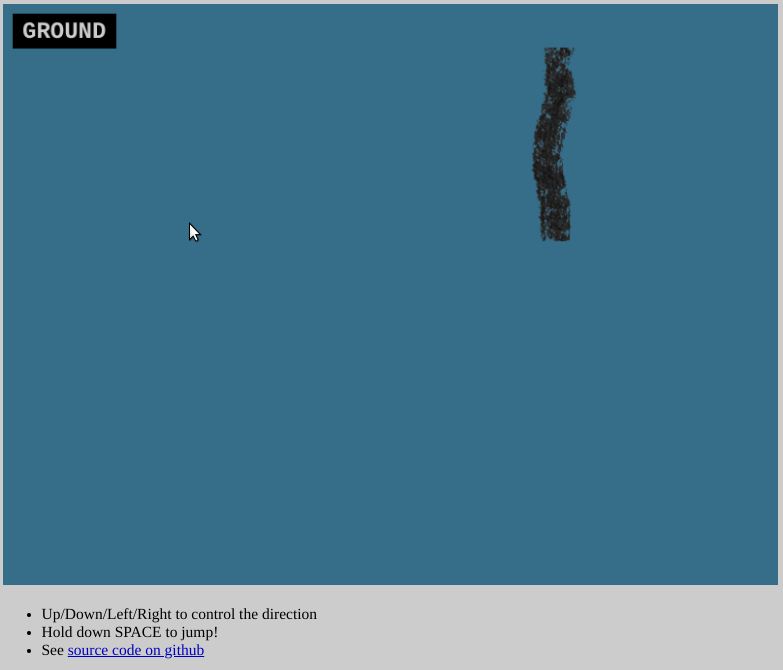

# Paper Snake

> An over-under snake game!


[Play here!](https://awwaiid.github.io/paper-snakes/)

 _GIF demonstrating Paper Snake. Red shadows are when the snake is jumping._

## How to Play

Use arrow-keys to turn. Use spacebar to jump over things!

## Development


Start development server:

```
npm run start
```

To create a production build:

```
npm run build
```

Production files will be placed in the `dist` folder. Then upload those files to a web server. 🎉

## References / Shout-Outs / License

Initial setup on [phaser3-vite-template](https://github.com/ourcade/phaser3-vite-template).

[GPL](/LICENSE)
